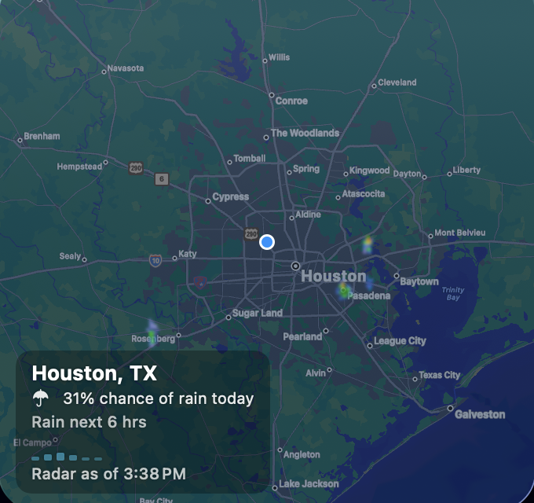

# Weather Widget

A macOS desktop widget that shows a live weather radar map for your location, with severe weather warnings, hurricane forecast cones, and an hourly rain outlook — all rendered as a WidgetKit widget you can pin to your desktop or Notification Center.

## Features

- Live radar imagery over a map of your area, using the MRMS clutter-filtered US mosaic with a global fallback
- Severe weather warning badges (tornado, severe thunderstorm, flash flood, marine, flood) color-coded by type
- Tropical outlook: hurricane forecast cones on the map and estimated tropical-storm wind arrival times
- Hourly rain chance sparkline for the next 6 hours, shown only when rain is plausible
- Daily rain chance and radar timestamp in the caption
- Day/night map styling based on local solar time, with a snow tint when precipitation is frozen

## Installation

Download the latest release, unzip it, and drag **Weather Widget.app** to Applications. Launch it once, then add the radar widget from the widget gallery (right-click the desktop → Edit Widgets).

To build from source, open `Weather Widget.xcodeproj` in Xcode and build the **Weather Widget** scheme.

## Data sources

This app is possible thanks to these freely available services:

| Source | Used for |
|---|---|
| [NOAA / National Weather Service](https://www.weather.gov/) | MRMS radar mosaic, precipitation type, warnings, and National Hurricane Center tropical products (public domain) |
| [Iowa Environmental Mesonet](https://mesonet.agron.iastate.edu/) | Radar tile cache, storm attributes, and warning polygons |
| [Open-Meteo](https://open-meteo.com/) | Hourly and daily precipitation forecasts (data CC BY 4.0, free for non-commercial use) |
| [RainViewer](https://www.rainviewer.com/) | Global radar coverage outside the US |
| [NASA GIBS](https://www.earthdata.nasa.gov/engage/open-data-services-software/earthdata-developer-portal/gibs-api) | Satellite imagery layers |

## License

MIT — see [LICENSE](LICENSE). The license covers the source code in this repository; weather data remains subject to the terms of the providers above.
